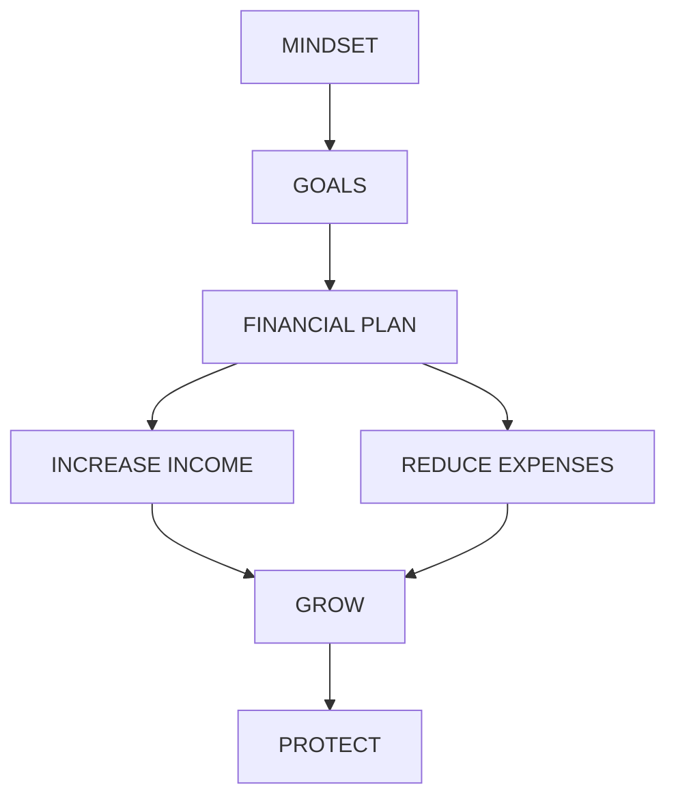

A career path intro book written by a Singapore millionaire, very concrete and mind-blowing.

<!-- more -->

# I Seven Steps to Financial Abundance

## 1 Secrets of A Self-Made Millionaire

### The Greatest Money Making Asset That Will Make You A Fortune
It is this one single asset that will generate for you unlimited wealth. This asset is your mind, also known as your intellectual asset!

When you invest time and money to expand your knowledge and skills, especially your financial education, it will return you millions of dollars in income streams for the rest of your life!

The reason why I believe in this so much is because like many self-made millionaires, I started with nothing but a hunger for knowledge of how to create wealth. 

Today, over 90% of a company’s value is in its intellectual assets! 

Over 90% of your wealth is not what you have in your wallet or in the bank, it is the ideas that you have in your head! In the information age of today, one great idea can be worth a billion dollars. 

### If You Want to Get a 1000% Return on Your Investment You Must Do this...
When it comes to specific activities, stop reading, grab a pen and follow the instructions that I will give to you. I believe that in jotting down and doing, you will truly integrate the essence of what I am going to share with you.

If you have little or no background in finance and accounting, some of the later chapters on investments may seem a bit intimidating, but don’t worry, keep pushing yourself and you will master it in no time.

Statistics have shown that 72% of people who buy a book never complete it and less than 3% ever follow through by applying what they have learned. 

So, get pro-active as you read and you will begin to see doors and windows opening for you.

### My Journey as a Self-Made Millionaire

And I created all this wealth starting with virtually nothing but the ideas in my head... the same raw material that you too have been blessed with. I did it without a single dollar in inheritance, no bank loans or any external investments.

### So How Did I Achieve All This?

I would say that the greatest contributing factor was my very intense desire for success and wealth. It was this passionate desire that drove me to want to learn everything I could about the strategies of the rich. From the age of 15, I was obsessed with reading books on
success and wealth from authors like Warren Buffett, Peter Lynch, George Soros, Anthony Robbins, Zig Ziglar and many others. I would model the mindsets and strategies of these people and begin to take and apply every new technique I learned until I achieved the results I wanted.

**nothing**

He knew that hunger was the key to motivation and the only way to make me hungry was
to deprive me. 

**own**

This was when I first adopted the belief that ‘money equals freedom’. This is one of the single
most important beliefs that has been the driving force behind my motivation to make money.

Looking back, it was during those days that I learned how to overcome shyness and the fear
of rejection... two important traits of becoming rich.

That boosted my confidence, as I had to learn how to speak and entertain in front of crowds. 

That was for free but that gave me the confidence and idea that I could start charging for my magic shows. 

It was at this camp that I was first exposed to the concept of Neuro-Linguistic Programming (NLP) and Accelerated Learning. I learned about the power of human potential and how anyone, with the right strategies can achieve any goal they set for themselves. NLP taught me how to set inspiring goals in my life and more importantly, how to build in myself the confidence and motivation to achieve them.

I learned that by modeling the mindset and strategies of anyone of excellence, I could produce the same outstanding results within a short period of time.

Empowered by the prospects of limitless self-growth, I applied everything I learned. 

Although I believed in the importance of excelling academically, I knew that scoring ‘A’s in school had very little to do with achieving success and creating wealth in life. 

One of the first books I read which influenced me tremendously was ‘Think and Grow Rich’ by Napoleon Hill. It was from Hill that I first understood the concept that money could be generated from ideas and not just hard work. I learned that if a person used his muscles, he would only be worth a few dollars a day. But if he were to use his mind, his wealth would be limitless.

### My Very First Business...Setting Up a Mobile Disco
That was when I first learned that great ideas make great money!

### My Second Business Idea...Adam Khoo & Associates
In fact, doing well academically helped me to create another source of income when I was in junior college doing my ‘A’ levels. 

However, after reading all these wealth books and learning the power of multiplying the effects of my efforts with ideas, I figured that I couldn’t make very much by tutoring one student at a time.

What really got me tons of business was when I decided to compile all my knowledge into a book. 

However, what truly enabled me to accumulate so much money was not so much the income I created, but the lessons I learned about saving and investing from the stacks of wealth books that I read. I develop the habit of saving far more than what I was earning, even when I was still studying.

Instead of spending my money indulging in fun and frivolous things, I invested almost everything I had into unit trusts and stocks through the investment strategies I had learned from reading books by wealth gurus like Warren Buffett, Peter Lynch and George Soros.

I knew when to sell not from a lucky tip-off, but through studying and understanding the market. 

At the age of 26, I had crossed the one million net worth mark.

All it took was intense desire, a mindset of infinite possibilities, the right strategies and consistent action and determination.

### Money is A Game...You Must Learn How to Play it
You see... making money is a game. If you learn the rules of this game, money will flow into your hands. If you do not play by the rules, you will struggle all your life financially despite working very hard.

Why? The **only** reason is because they know how to play the game of money whereas most people have not learned how the game is played.

You see... none of us are ever taught how to make money, how to invest money or how to manage our wealth and yet money is the most important subject in our adult lives. Although many people say that ‘**money isn’t everything**’, that’s only a half-truth. The truth is that ‘**everything is money**’! In order to achieve excellence in the different areas of lives like our health, relationships and family, we need to be financially secure!

To be financially secure means to be ‘Free’ .

The traditional education system (thank God it’s changing) never taught us how to be rich but instead brainwashed us into becoming poor. We are taught beliefs like ‘study hard, get good
grades and a good job and you’ll be set for life!’, ‘investing is risky’, ‘don’t act smart’, ‘don’t play with stocks or you’ll get burnt’, ‘don’t be so money-faced’ or ‘don’t be so stingy’.

As result of all the wrong anti-wealth advice, most people work hard all their lives, going around in circles in the rat race and ending up broke and unhappy. However, a fortunate few eventually learn that wealth is not made by just getting a good job and working hard. It takes a different way of thinking and a totally different strategy. Those that learn this lesson get out of the rat race and onto the path of financial abundance and freedom.

### First… You Must Know Why You Are Not Rich, Yet
> Reasons Why I Am Not Rich Yet
>
> 1. I'm too lazy		                                                           ✓
> 2. I'm lack of enough confidence                                  ✓
> 3. I was born in a poor family                                       ㄨ
> 4. I lack the financial know-how                                    ✓
> 5. I am afraid of taking risks                                          ✓
> 6. I lack discipline                                                             ✓
> 7. I have a suppressing family circumstance              ㄨ
> 8. I have no capital                                                          ㄨ

Why? Because the reasons you give yourself is a reflection of whether you have the
Winner’s mindset or the Victim’s mindset.

The reason all these are lousy excuses is because we know that there are many examples
of people who have created wealth for themselves, despite all these perceived disadvantages.

Victims also tend to blame everyone except themselves. 

And instead of finding a way to improve and change, victims spend their time complaining but not do anything about it.

The trouble is that when you give yourself excuses, blame others and whine, it means that someone else or something else is controlling your life and your (lack of) wealth. Since you believe that it is not your fault, then you are powerless to change it. If you have a victim’s mindset and hold doggedly onto the belief that external forces are controlling your wealth, then any strategy you learn will be of no use!

| WINNER’S MINDSET                         | VICTIM’S MINDSET                                         |
| :--------------------------------------- | -------------------------------------------------------- |
| Take 100% Responsibility & Ownership | Give Excuses  Blame Others  Complain |

In order to fully benefit from the teachings in this book, you must first adopt the winner’s mindset. Winners take a hundred percent responsibility for the results in their life. They take ownership over their wealth. When their sales drop, they don’t blame their customers or the economy. They know that doing so will be futile since they can’t change these external factors. Instead, they take full responsibility for the fact that they did not sell hard enough, did not meet enough prospects or they used ineffective closing strategies. By taking responsibility for your results, you give yourself the power to change it! When winners don’t get a pay increase, they don’t blame their boss or their company, they take responsibility for the fact that they have not created enough value, not demonstrated their worth or have not asked for it!

The moment you acknowledge that you create your own fortune (or lack of it), it means that you have given yourself the power to start becoming rich right now! When you learn the strategies of wealth creation, you will find that you can make money at any age, with any background, with little or no money and in any economy. To find out how millionaires achieve this, you must first know ‘The Seven Steps to Financial Abundance’.

## The Seven Steps to Financial Abundance
Although one millionaire may have made his money in real estate while another made her money providing children’s education, I would bet that all of them share similar wealth creating skills and took certain similar steps that allowed them to build up a large personal fortune. Of course there are individuals who seem to have oodles of money without having any of these wealth creating skills. They are usually people who inherited their money, won the lottery or have a marketable talent like singing. However, time and again it has been proven that if they do not eventually learn the necessary money skills, or have a trustworthy and money savvy manager, they will usually end up losing everything they have. 

These are seven essential steps, each one representing a wealth creating skill that all self-made millionaires possess and practice.

### Step 1: Adopt the Million-Dollar Mindset

Millionaires think very differently and that is why they take different actions and produce vastly different results. Self-made millionaires have a different set of beliefs and habits that allow them to see opportunities where others see problems.

Millionaires see learning experiences, where Mister Ordinary sees failure. The moment you adopt the beliefs and habits of a millionaire, your perception of the world will change completely
and you will realize that there are money-making opportunities everywhere and everyday around you.

*In chapter 3, you will learn the Nine Habits of Self-Made Millionaires and how to program your beliefs in such a way that your subconscious mind will begin to attract wealth to you.*

### Step 2: Set Clear Financial Goals

Wealth never happens by chance. It always begins with a clear goal in mind. At one point of time in their life, millionaires always make a decision to become rich. However, whenever I ask most people what their financial goals are, I often get a blank stare. When I ask people to write down their target income or how much they want to be worth, the standard answer I get is ‘as much as I can get’. This is a major reason why they will never achieve any level of wealth because they have no clue what it is. Unless you have a specific figure to focus on, you will never be able to develop a strategy to achieve it.

Only when you are specific abut how much wealth you want to create, then you will come up
with a practical plan to execute it. No matter where you are now financially, any target is possible as long as you use the right strategy.

In chapter 5, you will learn about the Four Levels of Wealth and how to achieve them. They are financial stability, financial security, financial freedom and financial abundance

### Step 3: Create A Financial Plan

Goals by themselves are nothing but pipe dreams. Only when you create a plan, have you
made your goal a possibility. The moment you start taking action on your plan, your dream becomes a reality.

Most people never achieve their financial dreams simply because they have no financial plans and haven’t got a clue as to how to create one. They just work hard and hope that everything will be okay one day. You cannot leave your financial future to chance, you have got to plan for it. While there are great financial planners around who can give you some sound advice, you must ultimately take responsibility and develop your own plan! After all, it is your life we are talking about.

*In chapters 4 and 5, you will learn how to craft a financial strategy and plan for yourself to reach the four levels of wealth.*

### Step 4: Massively Increase Your Income

After developing their financial plan, most people tend to become initially disheartened. They look at their plan and realize that with the amount they are earning and saving right now, it will be decades before they see any big money.

It is therefore important that you learn how to accelerate and turbo-charge your financial plan by taking steps to massively increasing your income. When I talk about increasing your income, I am not talking about a 5%, 10% or even 20% increase, I am talking about doubling, tripling or even increasing your income by five to ten times? Is this possible? Yes! And it is definitely achievable without you having to quit your job or risking a lot of capital (your savings) in a business venture.

*In chapters 6, 7 & 8, you will learn practical and proven methods that thousands of people use to create multiple streams of income for themselves. And in chapters 9, 10, 11 and 12, you will learn how you can start a lucrative home-based business and reach out to a global marketplace with the power of the Internet. You will learn how students, professionals, retirees and housewives have created a sustainable source of income for themselves.*

### Step 5: Manage Your Money & Reduce Expenses
The reason is because when we don’t manage the money we earn, our expenses will always rise to our level of income, wiping out any surplus we have! Or worse, we start spending on credit lured by easy repayment schemes. Millionaires become rich not because of how much they earn, but rather how much they are able to save and invest.

*In chapters 13 and 14, you will learn the essential money skills of how to track every dollar that flows through your hand and how you can amazingly reduce your expenses by 20%-30% without compromising your standard of living.*

### Step 6: Grow Your Money at Millionaire Returns
By increasing your income and reducing your expenses, you will find that you will be able to accumulate a surplus of funds that you can use to help you build your fortune. You need to do this because, no matter how hard you work and save, you will never be able to create phenomenal wealth unless you learn how to put your money to work for you. Through the power of compounding, you will be able to take small sums of money and build it into huge returns over time.

All self-made millionaires attribute a huge part of their wealth to their investments because they know that just working for money will never make them rich. It is when you allow your money to make you money that substantial wealth can be created.

If you’ve had the bad experience of losing money in stocks and mutual funds and resigned yourself to believing that the only safe way to invest is to put your money in the bank and get 3% returns, don’t worry. The strategies that I will be sharing carry minimal risk. Remember self-made millionaires are shrewd risk takers and this is very different from being gamblers.

*In chapters 15 to 19, you will learn never-before revealed investment techniques that can allow you to earn millionaire returns of 15%-25% per year with minimal risk. At this rate, your portfolio will be doubling in value every three to four years!*

### Step 7: Protect Your Fortune

There are many people who have taken decades to build their fortune only to see it wiped out by an accident, unforeseen illness or through an unexpected lawsuit. Self-made millionaires engage professionals like insurance advisors, lawyers and accountants to help them build a financial fortress so their wealth is protected from potential creditors, plaintiffs looking to sue and the government who may take away a big chunk of your wealth through a whole range of taxes that you may not have even heard about.

As it is beyond the scope of this book, I highly recommend that you engage such professionals who will help you use a variety of tools like insurance, trusts, offshore accounts to ensure no one or nothing can touch your wealth once you have built it.